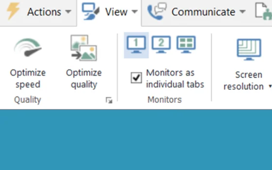
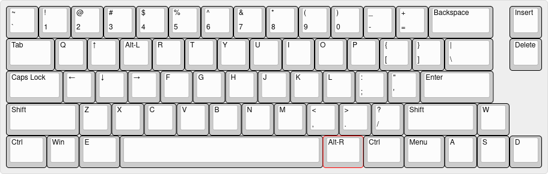

# Teamviewer-Remote-Gaming
Tips and Docs for remote gaming over TeamViewer (only do this if you hate yourself) 

## Motivation
At the beginning of 2020, I began work on a series of experiments involving live game network traffic capture. These experiments were conducted in a highly controlled environment in a lab on a particular pc. Due to the covid pandemic, we had to go remote. The remote viewing app TeamViewer was already installed on the target machine and TeamViewer had a low impact on the tests being run so it was chosen to be used for the remainder of the experiment. NOTE the target game was an FPS.

**To Be Clear** This is no substitute for other remote gaming systems. You will not have a good time gaming over Teamviewer. We only did this to collect network data without having downtime during a crisis. Teamviewer is designed for remote system admin tasks and not gaming. As such there are many technical issues to overcome.

**If You Must Try This** the following tips and tricks will help. 

## Performance

Teamviewer has options of "optimize speed" and "optimize quality" under the view tab.

 

On "optimize speed" you can expect to get a reasonable frame rate with playable latency. This will mean you will see most of the detail on higher graphics settings so don't bother with them on the remote machine. Ideally, the remote machine will be pumping out very high fps on low settings for stability.

## Mouse
TeamViewer uses some weird trick to figure out how far your mouse moved that totally throws off mouse controls for shooters. While I'm not a fan of high dpi gaming, I found it impossible to turn around without cranking up the sensitivity in-game. Remote system mouse sensitivity seems to have no effect. This seems to be less of a problem if you are using 2 displays of similar size and ppi.

## Keyboards
This is the biggest problem and took the longest to figure out. For simplicity, TeamViewer doesn't implement held letter keys [(confirmed in this thread on the customer support forums)](https://community.teamviewer.com/English/discussion/6465/key-press-delays-wasd-for-example). This is again entirely understandable. The app is not made for this.

As a result, in-game 'w' is never held and the charter just shakes in place instead of walking forward. This is true for all held letter and number keys. However, modifier keys that need to be held like shift do work. If the target game can be re-mapped to arbitrary keys you can use the following keymap on your local machine to implement most shooter controls without conflicting with windows functions.

## Xmodmap

On Linux systems with xmodmap installed I have provided 2 bash scripts that will switch you to the shooter keymap specified above

shoot_switch.sh switches your keys to the keymap and shoot_bck.sh reverts the changes

xmodmap changes don't hold after a reboot so there is no way to get stuck in the wrong keymap.